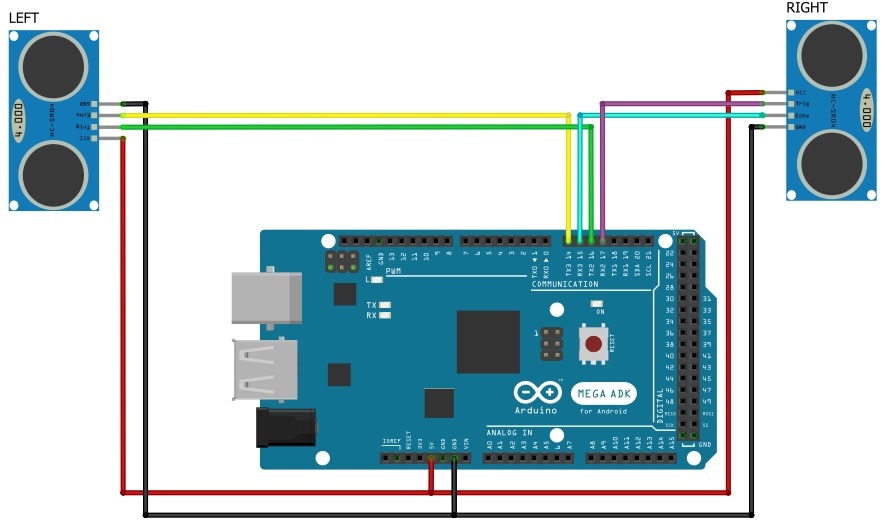
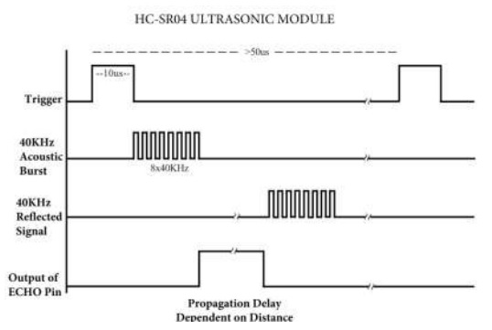
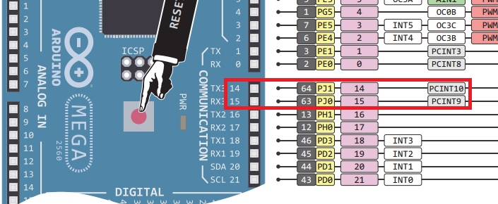
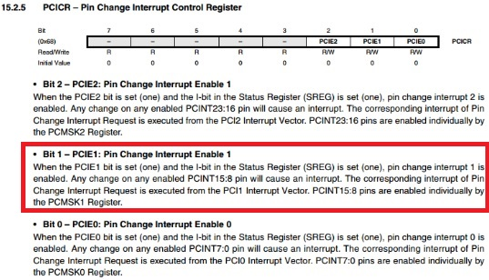
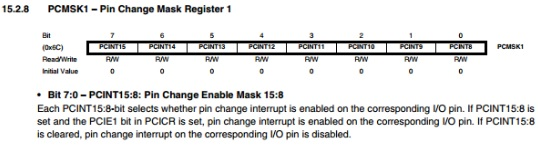

# R&D 2xHC-SR04 by Interruptions

Distance measurement by ultrasonic sensors with replacement of the *pulseIn()* blocking function by **interrupt management** on Arduino Mega.

---

## Datasheets

[Ultrasonic Ranging Module HC - SR04](https://cdn.sparkfun.com/datasheets/Sensors/Proximity/HCSR04.pdf)

[Arduino Mega PINOUT](./assets/arduino-mega2560_PINOUT.pdf)

[atmega 2560 (µC on Arduino Mega)](https://ww1.microchip.com/downloads/en/DeviceDoc/ATmega640-1280-1281-2560-2561-Datasheet-DS40002211A.pdf)

---

## Wiring

  

---

## HC-SR04 sensor operation reminder

- To start a new measurement, the TRIGGER pin should be turned HIGH for 10 µs
- The sensor will generate 8 ultra-sound wave trains at 40 Khz
- Then the sensor will pass the ECHO pin to the HIGH state thus marking the start of the measurement
- On receiving the ultrasound return, the sensor will switch the ECHO pin to the LOW state. So the time between the transition from the HIGH state to the LOW state will correspond to the measured distance

 

- Time = Width of Echo pulse, in uS (micro second)
  - Distance in centimeters = Time / 58
  - Distance in inches = Time / 148
  - Or you can utilize the speed of sound, which is 340m/s

---

## The interrupt vector

The principle is

- start the stopwatch when ECHO goes HIGH
- stop  the stopwatch when ECHO goes LOW

We will therefore detect a change of state on the ECHO pins of the Left sensor or the Right sensor by interruption.

RIGHT ECHO on pin15 -> Port J.0 -> PCINT09  
LEFT  ECHO on pin14 -> Port J.1 -> PCINT10  
PCINT09 and PCINT10 raise the interrupt vector PCINT1

   

To activate the interrupt on port J, change the PCIE1 bit of the PCICR register to 1

 

And activate the interrupt only for pin 14 & 15 (PJ1 & PJ0) with in the register PCMSK1

 

## All the details on setting up the interrupt routine (ISR) are in the source code in comment
