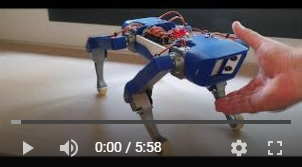

# Putting interrupts into practice on Arduino Mega for HC-SR04 distance sensors on the SpotMicro dog robot

- All the details of the tests and developments on the Ultrasonic HC-SR04 distance sensors by interrupt:
[https://github.com/Nao974/R-D_2xHC-SR04_by_interrupt](https://github.com/Nao974/R-D_2xHC-SR04_by_interrupt)

- My Choreograph software for creating positions and movements for all types of servo-motor-based robots:
[https://github.com/Nao974/choreograph-git](https://github.com/Nao974/choreograph-git)

- Parts for 3D printing: [https://www.thingiverse.com/thing:3445283](https://www.thingiverse.com/thing:3445283)

---

